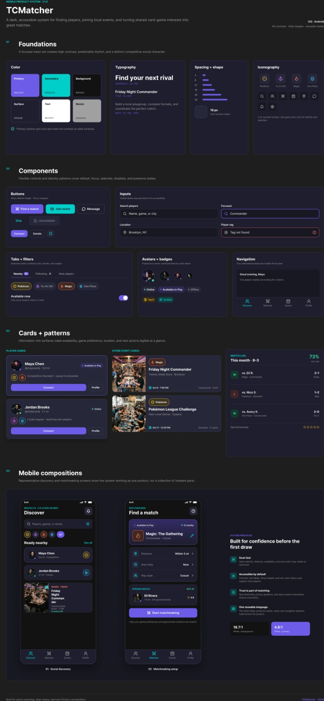
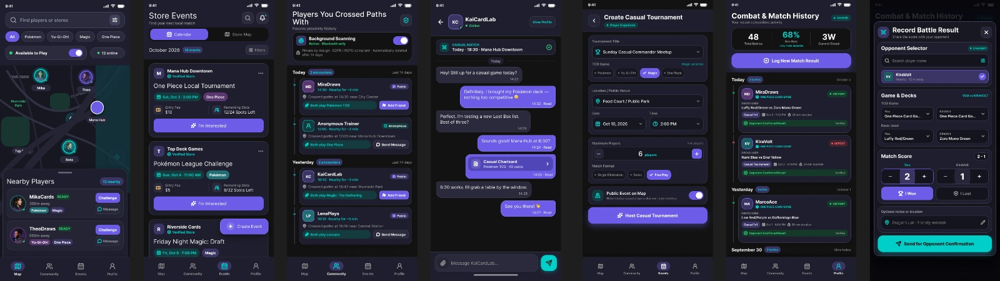
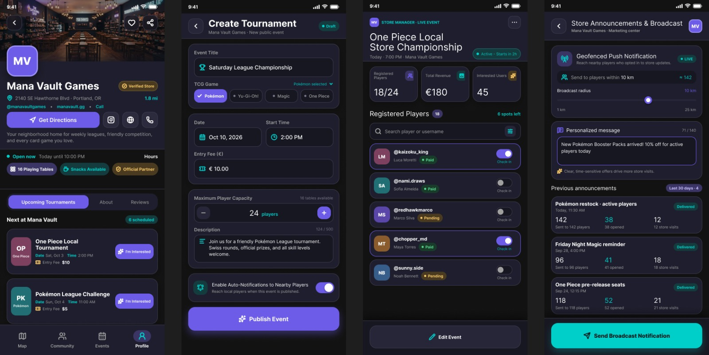

# UNIVERSIDADE EUROPEIA / IADE
## Faculdade de Design, Tecnologia e Comunicação
### Licenciatura em Engenharia Informática
**Projeto Multidisciplinar – Projeto Mobile (3.º Semestre / 2026-2027)**

---

# TCMatcher
### Plataforma de Geolocalização e Gestão de Comunidades para Trading Card Games
*Primeira Proposta de Projeto (Entrega 1)*

---

## Identificação dos Estudantes

* **Estudante 1:**
  * **Nome Completo:** Samuel Livramento Alves Longo
  * **Número de Estudante:** 20251469
  * **Curso:** Licenciatura em Engenharia Informática
  * **Ano Curricular:** 2.º Ano / 3.º Semestre
  * **Email Institucional:** 20251469@iade.pt

* **Estudante 2:**
  * **Nome Completo:** Matheus Reis Correi Borges
  * **Número de Estudante:** 20250417
  * **Curso:** Licenciatura em Engenharia Informática
  * **Ano Curricular:** 2.º Ano / 3.º Semestre
  * **Email Institucional:** 20250417@iade.pt

* **Estudante 3:**
  * **Nome Completo:** Elmer Otchali Safeca Moreso
  * **Número de Estudante:** 20250922
  * **Curso:** Licenciatura em Engenharia Informática
  * **Ano Curricular:** 2.º Ano / 3.º Semestre
  * **Email Institucional:** 20250922@iade.pt

* **Estudante 4:**
  * **Nome Completo:** Henrique Alexandre Corrêa Carvalho
  * **Número de Estudante:** 20250852
  * **Curso:** Licenciatura em Engenharia Informática
  * **Ano Curricular:** 2.º Ano / 3.º Semestre
  * **Email Institucional:** 20250852@iade.pt

---

## Corpo Docente e Unidades Curriculares Envolvidas

* **Projeto de Desenvolvimento Móvel:** Prof. Fábio Guilherme
* **Programação de Dispositivos Móveis:** Prof. João Pedro Monge
* **Bases de Dados:** Prof. Miguel Boavida
* **Redes e Comunicações de Dados:** Prof. Nathan Campos & Prof. Pedro Rosa
* **Interfaces e Usabilidade:** Prof.ª Paula Neves
* **Matemática Discreta:** Prof. André Torcato & Prof. Ricardo de Sousa

---

## Acesso ao Repositório do Projeto

* **GitHub Repository:** [https://github.com/Bodinthekid/TCMatcher](https://github.com/Bodinthekid/TCMatcher)

**Palavras-Chave:**  
`Trading Card Games (TCG)` · `Geolocalização` · `Flutter & Dart` · `Node.js REST API` · `MySQL` · `Mobile Matching` · `Comunidades Locais`

---

## Índice

1. [Introdução e Enquadramento](#introdução-e-enquadramento)
2. [Objetivos e Motivação](#objetivos-e-motivação)
3. [Público-alvo e Análise de Mercado](#público-alvo-e-análise-de-mercado)
4. [Casos de Utilização](#casos-de-utilização)
5. [Arquitetura do Sistema e Enquadramento Técnico](#arquitetura-do-sistema-e-enquadramento-técnico)
6. [Privacidade e Conformidade com RGPD](#privacidade-e-conformidade-com-rgpd)
7. [Planeamento e Calendarização](#planeamento-e-calendarização)
8. [Conclusão](#conclusão)
9. [Anexos](#anexos)
10. [Bibliografia](#bibliografia)

---

## Introdução e Enquadramento

O universo dos Trading Card Games (TCG), que engloba títulos mundialmente reconhecidos como Pokémon TCG, Yu-Gi-Oh!, Magic: The Gathering e o recente e popular One Piece Card Game, tem registado um grande crescimento nos últimos anos. Estes jogos destacam-se não apenas pela sua componente estratégica e colecionável, mas fundamentalmente pela sua forte vertente social. No entanto, a comunidade enfrenta um obstáculo significativo: a dificuldade em encontrar adversários fora do contexto de torneios oficiais.

Nos dias de hoje, a prática presencial destes jogos está altamente centralizada nas lojas físicas especializadas (*Game Stores*). Embora estas lojas sejam o centro do mundo competitivo, a dependência exclusiva destes espaços cria vários problemas. Os jogadores são obrigados a pagar taxas de inscrição em torneios apenas para poder jogar, e os encontros casuais ficam restritos ao horário de funcionamento destas lojas. Tirando estes espaços, o encontro casual entre jogadores é feito de maneira fragmentada através das redes sociais.

É neste contexto que surge o presente projeto: a aplicação móvel **TCMatcher**. Esta plataforma propõe-se a atuar como uma ponte entre o digital e o físico, permitindo que jogadores encontrem adversários nas suas proximidades geográficas para partidas casuais e gratuitas em espaços públicos. Em simultâneo, a aplicação não exclui as lojas pelo contrário, integra-as no ecossistema através de perfis dedicados onde podem gerir e promover os seus torneios, criando uma simbiose entre o jogo casual e competitivo.

---

## Objetivos e Motivação

A principal motivação para o desenvolvimento desta aplicação nasce da necessidade de modernizar e descentralizar a forma como as comunidades de TCG se reúnem. O projeto planeia disseminar o acesso ao jogo presencial, removendo as dificuldades financeiras e logísticas das partidas casuais.

Os objetivos principais do projeto dividem-se em duas vertentes: o utilizador (jogador e loja) e a vertente técnica e académica.

### Objetivos Funcionais
* Desenvolver um sistema de geolocalização num mapa interativo que exiba jogadores disponíveis e lojas num determinado raio de alcance.
* Implementar um sistema de gestão de histórico de partidas, permitindo aos jogadores registarem as suas vitórias, derrotas e analisarem o seu desempenho.
* Fornecer um sistema de deteção passiva que registe em segundo plano o cruzamento físico entre utilizadores com interesses em comum.
* Criar ferramentas de publicação de calendários de eventos exclusivos para contas de Lojas/Organizadores.

### Objetivos Técnicos e Académicos
* Desenvolver uma interface móvel multiplataforma em **Flutter**.
* Estruturar uma API RESTful utilizando **Node.js**.
* Modelar e implementar uma base de dados relacional robusta em **MySQL**.
* Garantir uma experiência de utilização fluida e intuitiva através do **Figma**.

---

## Público-alvo e Análise de Mercado

O público-alvo desta aplicação é dividido, atendendo a dois segmentos que dependem intrinsecamente um do outro:

* **Jogadores de TCG (Casuais e Competitivos):** Indivíduos que procuram testar os seus baralhos (*decks*), treinar para torneios ou simplesmente socializar através do jogo, sem restrições de espaço ou custos associados.
* **Lojas Físicas e Organizadores Locais:** Pequenos e médios negócios que necessitam de uma plataforma direcionada para anunciar os seus eventos, vender os seus produtos e atrair a comunidade local para o seu espaço físico.

Na fase de **Pesquisa de Mercado**, foram analisadas plataformas atualmente utilizadas pelos jogadores. Aplicações como a *Companion App* da Wizards of the Coast (para Magic) ou a *Bandai TCG Plus* (para One Piece) focam-se quase em exclusivo na componente burocrática da organização de torneios oficiais. Estas apps são exclusivas dos seus respetivos jogos, são conhecidas por terem interfaces pouco intuitivas e ignoram completamente a componente social de descoberta de jogadores casuais no dia a dia. Por outro lado, o *SpellTable* é excelente, mas focado no jogo através de webcam. O TCMatcher propõe ser diferente ao agregar múltiplos jogos numa única plataforma, promovendo o encontro presencial e integrando um sistema de chat e comunidades.

---

## Casos de Utilização

Para ilustrar a funcionalidade e a jornada do utilizador dentro da aplicação, detalham-se de seguida três casos de utilização fundamentais:

### Caso de Utilização 1: Encontrar e Desafiar um Jogador Casual
* **Ator:** Jogador de TCG
* **Cenário:** O utilizador encontra-se numa praça de alimentação de um centro comercial com o seu deck de One Piece e tem uma hora livre. Ele abre a aplicação, seleciona o jogo “One Piece TCG” e altera o seu estado para “Disponível para jogar”. Através do mapa interativo, a aplicação mostra que existe outro jogador com as mesmas preferências a 200 metros de distância. O utilizador consulta o perfil do possível adversário, verifica a sua taxa de vitórias e envia uma mensagem direta através do chat integrado da aplicação: *“Olá, queres fazer um jogo rápido?”*. Após o encontro, ambos os jogadores inserem o resultado da partida na aplicação, que atualiza automaticamente o histórico e as estatísticas de batalha de ambos.

### Caso de Utilização 2: Gestão de Calendário por uma Loja Local
* **Ator:** Gestor da Loja
* **Cenário:** Uma loja pretende organizar um torneio local de Pokémon TCG para o próximo sábado. O gestor efetua a autenticação na aplicação com as suas credenciais. No painel de controlo da loja, acede à secção de eventos e cria um novo torneio, preenche os campos: Jogo, Data, Hora, Taxa de Inscrição e Limite de Vagas. A partir desse momento, a loja ganha um pin de destaque no mapa. Todos os jogadores num raio predefinido recebem uma notificação ou podem visualizar o evento na aba “Calendário”, tendo a opção de marcar o seu interesse no evento, auxiliando a loja na previsão de afluência.

### Caso de Utilização 3: Deteção Passiva por Proximidade
* **Ator:** Jogador com permissões de localização ativas em segundo plano
* **Cenário:** Dois utilizadores desconhecidos, mas ambos jogadores de Yu-Gi-Oh!, caminham pela mesma rua ou frequentam a mesma universidade. A aplicação, a correr em segundo plano nos respetivos dispositivos móveis, utiliza serviços de localização para detetar a interseção das suas áreas. Sem revelar a sua localização exata por questões de privacidade, o servidor regista este encontro. Mais tarde, quando um dos utilizadores abre a aplicação, acede à aba “Pessoas com quem te cruzaste” e visualiza o perfil do outro jogador, podendo enviar-lhe um pedido de mensagem para futuros encontros.

---

## Arquitetura do Sistema e Enquadramento Técnico

Para tornar esta solução viável, o projeto foi arquitetado tendo em conta as melhores práticas da engenharia de software e os requisitos curriculares estabelecidos para o semestre em curso. O sistema baseia-se numa arquitetura **Cliente-Servidor** separada em três camadas principais: Frontend, Backend e Base de Dados.

1. **Frontend:** A aplicação cliente será desenvolvida na framework **Flutter** com a linguagem **Dart**. Esta escolha justifica-se pela capacidade do Flutter em compilar código nativo tanto para Android como para iOS a partir de uma única base de código. A interface de utilizador (UI) está a ser prototipada no **Figma**, com foco especial na Experiência do Utilizador (UX). O design prevê uma distinção clara entre os menus dos Jogadores e o Dashboard das Lojas. A integração com mapas será efetuada através de APIs de mapeamento (como Google Maps SDK ou Mapbox).
2. **Backend:** A comunicação entre a aplicação móvel e o servidor será realizada através de uma **API RESTful**. O servidor será programado em **Node.js** utilizando a framework **Express**. As comunicações utilizarão o protocolo **HTTP/HTTPS**, com respostas estruturadas em formato JSON. Esta vertente de Redes verá a sua aplicação prática na otimização dos pedidos ao servidor, especialmente no que toca à atualização de coordenadas de localização e ao sistema de mensagens de chat, garantindo latências baixas e um consumo eficiente de dados móveis.
3. **Base de Dados:** Os dados gerados pela aplicação serão armazenados numa base de dados **MySQL**. O esquema da base de dados encontra-se em fase de modelação, prevendo a normalização de tabelas fundamentais como: `Utilizadores`, `Lojas`, `JogosTCG`, `Eventos_Torneios`, `Matchs_Historico` e `Mensagens_Chat`. A integridade referencial será garantida através de chaves estrangeiras, assegurando, por exemplo, que um histórico de partida está sempre associado a dois identificadores de jogadores válidos.

---

## Privacidade e Conformidade com RGPD

Um dos maiores desafios tecnológicos e éticos deste projeto encontra-se na gestão de dados de geolocalização. Sendo o tratamento de dados sensíveis regulamentado pelo **Regulamento Geral sobre a Proteção de Dados (RGPD)**, a aplicação adotará medidas estritas de segurança.

A localização exata dos utilizadores **nunca será publicamente exibida**. Em vez de apresentar coordenadas geográficas precisas no mapa de outros jogadores, o sistema utilizará raios de aproximação e arredondamentos matemáticos. Adicionalmente, funcionalidades como a deteção passiva atuarão estritamente em regime de *opt-in* e poderão ser desativadas a qualquer instante.

---

## Planeamento e Calendarização

*(Ver cronograma detalhado de tarefas e entregas no diagrama de Gantt do projeto).*

---

## Conclusão

A plataforma **TCMatcher** representa uma solução tecnológica completa para um problema altamente específico, mas de elevada relevância para uma comunidade em forte expansão. Acreditamos que juntar a geolocalização dos jogadores com os calendários das lojas torna esta aplicação numa ferramenta muito útil e essencial para toda a comunidade de TCG.

Através do cumprimento rigoroso do planeamento da aplicação e da integração dos conhecimentos de Programação Móvel, Redes e Base de Dados, o nosso grupo planeia entregar não apenas um protótipo funcional, mas um produto coeso, escalável e centrado na melhoria da interação social.

---

## Anexos
   
* **Figura A.1** – Design System e Guia de Estilos da Aplicação TCMatcher

   
* **Figura A.2** – Ecrãs de Interação do Jogador, Deteção e Histórico de Partidas

   
* **Figura A.3** – Interfaces de Gestão de Eventos e Lojas Parceiras 

---

## Bibliografia

* Google. (2026). *Gemini* (Versão de outubro de 2026) [Modelo de linguagem de grande escala]. [https://gemini.google.com/](https://gemini.google.com/)  
  *(Nota de contexto: Utilizado para assistência na revisão estilística, sintática e formatação textual do relatório).*
